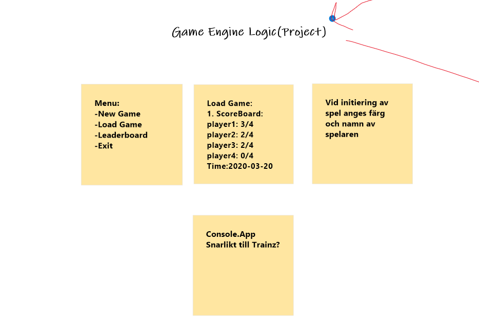
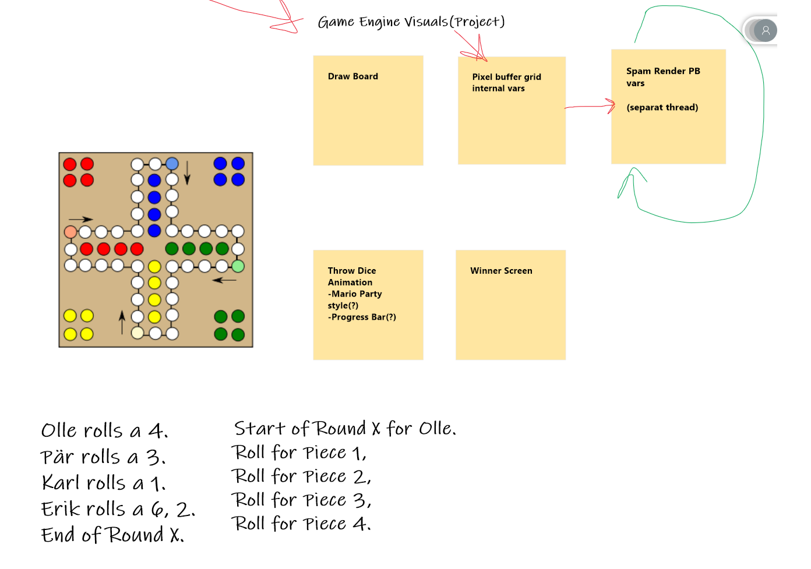

# Dokumentation

We used the MS Whiteboard to all be able to write and post pictures in a shared enviroment were we could all do actions at the same time.

## Picture 1

## Picture 2

## Picture 3

## Full Image

# User Stories

As a user, I want a program thats easily understod.

As a programmer, I want to see structured code.

As a user, I want the program to run smoothly.

As a gamer, I want interactive gameplay so that my skill matters.

# Documentation

Use this file to fill in your documentation
